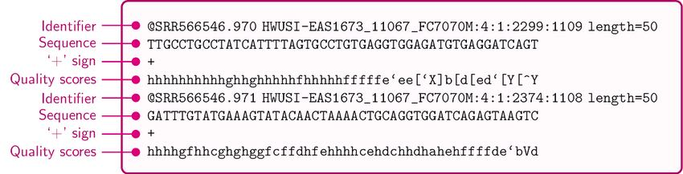

# Activity 1: Whole-Exome Sequencing (WES) Analysis

In this activity, we will analyze whole-exome sequencing data from the [SK-BR-3 breast cancer cell line](https://www.cellosaurus.org/CVCL_0033) to discover cancer mutations. This data was generated using paired-end Illumina sequencing.

We will perform the following steps:

1. [Quality control of the sequencing reads](#1-quality-control-of-the-sequencing-reads)
2. [Genome alignment with `bwa mem`](#2-genome-alignment-with-bwa-mem)
3. [Calling small somatic variants using `Mutect2`](#3-calling-small-somatic-variants-using-mutect2)
4. [Functional annotation of the variants using `Funcotator`](#4-functional-annotation-of-the-variants-using-funcotator)

Before beginning ensure you are in the `~/bootcamp-02-sequencing/01-whole-exome` directory and ensure that the `bootcamp` conda environment is activated. You can do this by running the following command:

```bash
cd ~/bootcamp-02-sequencing/01-whole-exome
source activate bootcamp
```

## 1. Quality control of the sequencing reads

You can find the FASTQ files containing our WES reads in the directory shown below

```bash
data/
├── wes_illumina_R1.fastq.gz # read 1
└── wes_illumina_R2.fastq.gz # read 2
```

### FASTQ format

Let's take a look at the first few lines of each file. Since the files are compressed, we will first decompress using `zcat` and then pipe the output to `head` to display the first 10 lines. Do you see the canonical four lines of a fastq file? Run the following command and compare the output with the image below.

```bash
zcat data/wes_illumina_R1.fastq.gz | head
zcat data/wes_illumina_R2.fastq.gz | head
```



What do you notice about the read IDs in corresponding lines of each file?

### WES FASTQ quality check

Now let's use [`fastqc`](https://www.bioinformatics.babraham.ac.uk/projects/fastqc/) to perform a quality check of the raw sequencing data. FASTQC will generate a report in HTML format, which you can open in your browser. To save time, we have already run `fastqc` and saved the reports. You can find the resultant HTML files at `data/wes_illumina_R*.fastqc.html`.

Take a look and the report and answer the following questions:

<!-- TODO: add sequencing duplication  -->
1. Are there any warnings or failures in the report? If so, inspect them.
2. What is the sequence length distribution of reads? Are they the same for both files?
3. What is the per base sequence distribution? What is the relationship between quality score and position in read? Why do you think this is?

You can also compare your report to examples for [Good Illumina data](https://www.bioinformatics.babraham.ac.uk/projects/fastqc/good_sequence_short_fastqc.html) and [Bad Illumina data](https://www.bioinformatics.babraham.ac.uk/projects/fastqc/bad_sequence_fastqc.html).

## 2. Genome alignment with `bwa mem`

To align the reads to the reference genome, we will use the [Burrows-Wheeler Aligner (BWA) Maximal Exact Match (MEM)](http://bio-bwa.sourceforge.net/) algorithm. BWA-MEM is a fast and accurate aligner for short reads and is the current gold standard for Illumina short-read genome alignment, although it will likely soon be replaced by Illumina's DRAGMAP method (you can read more about DRAGMAP vs BWA-MEM benchmarks [here](https://gatk.broadinstitute.org/hc/en-us/articles/4410953761563-Introducing-DRAGMAP-the-new-genome-mapper-in-DRAGEN-GATK)). Sequence and genome alignment is a heavily studied computational problem and will be covered in Pavel Pevzer's course "Bioinformatics II (BENG 202/CSE 282). Introduction to Bioinformatics Algorithms".


<!-- TODO: add command for bwa mem, but dont have them run it -->
<!-- TODO: add a note about reference genomes. have them peek at the fasta file -->

To save time, we have already run `bwa mem` and saved the alignments in the binary alignment map (BAM) format. You can find the resultant BAM file at `data/wes_illumina.bam`.

### Sequence Aligment/Map (SAM) format

Let's take a look at the BAM file header and the first 10 alignments. We will use [`samtools`](http://www.htslib.org/doc/samtools.html) to do automatically decompress and display the file contents. Do you see the canonical features of a SAM file? Run the following commands and check the outputs with the image below.

```bash
# check the file header
samtools view -H data/wes_illumina.bam 

# check the first 10 alignments
samtools view data/wes_illumina.bam | head
```


You can find a complete description of the SAM format specification here: [samtools.github.io/hts-specs/SAMv1.pdf](https://samtools.github.io/hts-specs/SAMv1.pdf).

### WES alignment statistics

Now, to understand the quality of the sequencing experiment and alignment, let's extract some summary statistics from the BAM file. `samtools` is a great tool for this. To discovery variants in the exome, we need to acheive sufficient depth of coverage of all the regions we targeted.

```bash
# number of reads mapped to each contig
# pipe to column -t to format the output for easy reading
samtools idxstat data/wes_illumina.bam | column -t

# see the coverage of chromosome 22
# pipe to column -t to format the output for easy reading
samtools coverage --region 22 data/wes_illumina.bam | column -t

# now let's look at the coverage around a region of a commonly mutated oncogene in breastcancer (HER2, aka ERBB2)
# we can use the --histogram option to visualize the coverage
samtools coverage --region 17:37840000-37880000 --histogram data/we_illumina.bam 
```

The FLAG column corresponds to bitwise flags that describe up to 13 features about each alignment, including if the read is paired, if the read and its mate are mapped or unmapped, the orientation of the read and its mate relative to the genome, and more. These flags are commonly used to evaluate the quality of the alignment. The Broad Institute has a simple online tool to decode SAM flags, available here [broadinstitute.github.io/picard/explain-flags.html](https://broadinstitute.github.io/picard/explain-flags.html).

We can use `samtools` again, this time using the `flagstat` subcommand to look at the number of reads that have each flag. Since this flagstat requires a full pass through the file, it can take a few minutes to run.

```bash
# number of reads categorized by each type of SAM flag
# let's specify using 8 threads to speed up the computation.
# this should take about 5 minutes to run
samtools flagstat -@ 8 data/wes_illumina.bam
```

<!-- TODO: view in jbrowser, look at one or two genes of interest (HER2,) -->

## 3. Calling small somatic variants using `Mutect2`

To determine which genes are mutated in this cell line, we will perform **variant calling**. By examining the differences between the reference genome and the aligned reads, we can identify regions of the genome that are different between the reference and the sample and call these regions as variants. [Mutect2](https://gatk.broadinstitute.org/hc/en-us/articles/360037225632-Mutect2) is a somatic short variant caller that is part of the [Genome Analysis Toolkit (GATK)](https://gatk.broadinstitute.org/hc/en-us), designed to call short nucleotide variants (SNVs) and insertions/deletions (indels). Like sequencing alignment, variant calling is a heavily studied computational problem and is covered in Melissa Gymrek's course "CSE 284. Personal Genomics for Bioinformaticians".

To save time, we have already run `Mutect2` on our whole-exome sequencing BAM file. You can find the resultant compressed VCF file at `data/wes_illumina_mutect.vcf.gz`.

### Variant Call Format (VCF)

Let's look at the top of the VCF file. We will use [`bcftools`](http://samtools.github.io/bcftools/bcftools.html) to automatically decompress and display the VCF. Do you see the canonical features of a VCF file? Run the following commands check the output with the image below.

```bash
# check the file header
bcftools view -h data/wes_illumina_mutect.vcf.gz

# cheeck the first 10 variants
bcftools view -H data/wes_illumina_mutect.vcf.gz | head
```


You can find a complete description of the VCF specification here: [samtools.github.io/hts-specs/VCFv4.2.pdf](https://samtools.github.io/hts-specs/VCFv4.2.pdf).

### WES variant calling statistics

Now let's look at the variant statistics using [`bcftools stats`](http://samtools.github.io/bcftools/bcftools.html#stats).

```bash
bcftools stats data/wes_illumina_mutect.vcf.gz 
```

<!-- TODO: add interpretation -->
<!-- TODO: add jbrowse -->

## 4. Functional annotation of the variants using `Funcotator`

While `Mutect2` discovers variants, it does not annotate them with information about how the variant may affect a gene's function. To do this, we will use the [Funcotator (FUNCtional annOTATOR)](https://gatk.broadinstitute.org/hc/en-us/articles/360035889931-Funcotator-Information-and-Tutorial) tool, which is also part of GATK.

```bash
# decompress the VCF file
gunzip data/wes_illumina_mutect.vcf.gz

# run funcotator
gatk Funcotator \
     --variant data/wes_illumina_mutect.vcf \
     --reference ref/hgs37d5.fa \
     --ref-version hg19 \
     --data-sources-path funcotator_dataSources \
     --output wes_illumina_mutect.funcotated.vcf \
     --output-file-format VCF
```

<!-- TODO: add interpretation, look through output for certain genes -->
<!-- TODO: compare to cosmic? -->