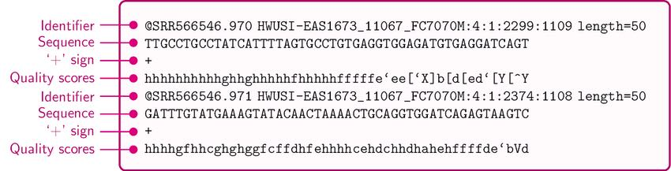
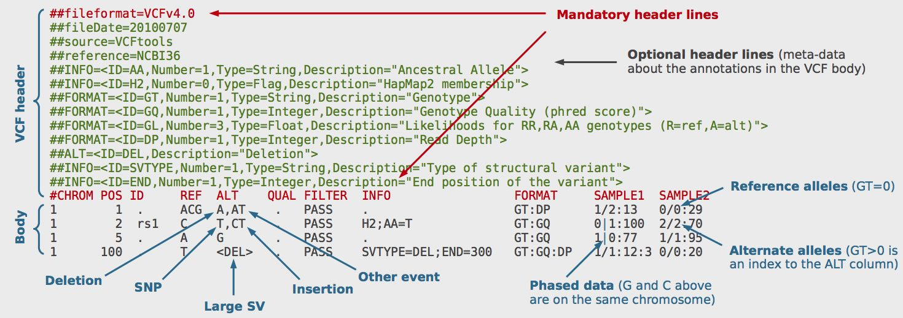

# Activity 1: Short-read DNA sequencing analysis

In this activity, we will analyze whole-exome sequencing data from the [SK-BR-3 breast cancer cell line](https://www.cellosaurus.org/CVCL_0033) to discover cancer mutations. This data was generated using paired-end Illumina sequencing, as part of the [Cancer Cell Line Encyclopedia (CCLE)](https://sites.broadinstitute.org/ccle/). 

Starting from the raw sequencing reads, we will perform the following steps:

1. Quality control of the sequencing reads
2. Genome alignment with BWA-MEM 
3. Small variant calling using Mutect2
4. Functional annotation of the variants using Funcotator

## 1. Quality control of the sequencing reads 

You can find the FASTQ files containing our whole-exome sequencing reads in the directory shown below

```bash
data/
|-- wes_illumina_R1.fastq.gz
|-- wes_illumina_R2.fastq.gz
```

Let's take a look at the first few lines of the first file. Since the file is compressed, we will first decompress it using `zcat` and then pipe the output to `head` to display the first 10 lines. Do you see the canonical four lines of a fastq file? Run the following command and compare the output with the image below. 

```bash
zcat data/wes_illumina_R1.fastq.gz | head
```



Now let's use [`fastqc`](https://www.bioinformatics.babraham.ac.uk/projects/fastqc/) to perform a quality check of the raw sequencing data. FASTQC will generate a report in HTML format, which you can open in your browser. Note that we downsampled these data to 1% of the original to speed up the analysis. 

```bash
# run fastq on each file
fastqc data/wes_illumina_R1.fastq.gz -o results/wes_illumina_R1.fastqc.html
fastqc data/wes_illumina_R2.fastq.gz -o results/wes_illumina_R2.fastqc.html
```

Take a look and the report and answer the following questions:

1. What is the read length distribution? Are they the same for both files?
2. What is the quality score distribution? Are they the same for both files?
3. What is the relationship between quality score and cycle number?

You can also compare your report to example reports for [Good Illumina data](https://www.bioinformatics.babraham.ac.uk/projects/fastqc/good_sequence_short_fastqc.html) and [Bad Illumina data](https://www.bioinformatics.babraham.ac.uk/projects/fastqc/bad_sequence_fastqc.html). 

## 2. Genome alignment with `bwa mem`

To align the reads to the reference genome, we will use the [Burrows-Wheeler Aligner (BWA) Maximal Exact Match (MEM)](http://bio-bwa.sourceforge.net/) algorithm. BWA-MEM is a fast and accurate aligner for short reads and is the current gold standard for Illumina short-read genome alignment, although it will likely soon be replaced by Illumina's DRAGMAP method (you can read more about DRAGMAP vs BWA-MEM [here](https://gatk.broadinstitute.org/hc/en-us/articles/4410953761563-Introducing-DRAGMAP-the-new-genome-mapper-in-DRAGEN-GATK)). Sequence and genome alignment is a heavily studied computational problem and will be covered in Pavel Pevzer's course "Bioinformatics II (BENG 202/CSE 282). Introduction to Bioinformatics Algorithms".

<!-- Add a note about reference genomes -->

To save time, we have already run `bwa mem` and saved the alignments in the binary alignment map (BAM) format. You can find the resultant BAM file at `data/wes_illumina.bam`.

Let's take a look at the BAM file header and the first 10 alignments. We will use [`samtools`](http://www.htslib.org/doc/samtools.html) to do automatically decompress and display the file contents. Do you see the canonical features of a SAM file? Run the following commands and check the outputs with the image below.

```bash
# check the file header
samtools view -H data/wes_illumina.bam 

# check the first 10 alignments
samtools view data/wes_illumina.bam | head
```


Now let's look at the alignment coverage of the reference genome using [`samtools coverage`](http://www.htslib.org/doc/samtools-coverage.html) and some alignment quality statistics using [`samtools flagstat`](http://www.htslib.org/doc/samtools-flagstat.html). These files are *not downsampled*, so these commands will take a few minutes to compute and display their respective metrics. 

```bash
samtools coverage data/wes_illumina.bam
samtools flagstat data/wes_illumina.bam
```

## 3. Calling small somatic variants using `Mutect2`

To determine which genes are mutated in this cell line, we will perform **variant calling**. By examining the differences between the reference genome and the aligned reads, we can identify regions of the genome that are different between the reference and the sample and call these regions as variants. [Mutect2](https://gatk.broadinstitute.org/hc/en-us/articles/360037225632-Mutect2) is a somatic short variant caller that is part of the [Genome Analysis Toolkit (GATK)](https://gatk.broadinstitute.org/hc/en-us), designed to call short nucleotide variants (SNVs) and insertions/deletions (indels). Like sequencing alignment, variant calling is a heavily studied computational problem and is covered in Melissa Gymrek's course "CSE 284. Personal Genomics for Bioinformaticians".

To save time, we have already run `Mutect2` on our whole-exome sequencing BAM file. You can find the resultant compressed VCF file at `data/wes_illumina_mutect.vcf.gz`.

Let's look at the top of the VCF file. We will use [`bcftools`](http://samtools.github.io/bcftools/bcftools.html) to automatically decompress and display the VCF. Do you see the canonical features of a VCF file? Run the following commands check the output with the image below. 

```bash
# check the file header
bcftools view -h data/wes_illumina_mutect.vcf.gz

# cheeck the first 10 variants
bcftools view -H data/wes_illumina_mutect.vcf.gz | head
```



Now let's look at the variant statistics using [`bcftools stats`](http://samtools.github.io/bcftools/bcftools.html#stats). 

```bash
bcftools stats data/wes_illumina_mutect.vcf.gz 
```

## 4. Functional annotation of the variants using `Funcotator`

While `Mutect2` discovers variants, it does not annotate them with information about how the variant may affect a gene's function. To do this, we will use the [Funcotator (FUNCtional annOTATOR)](https://gatk.broadinstitute.org/hc/en-us/articles/360035889931-Funcotator-Information-and-Tutorial) tool, which is also part of GATK.

```bash
# decompress the VCF file
gunzip data/wes_illumina_mutect.vcf.gz

# run funcotator
gatk Funcotator \
     --variant data/wes_illumina_mutect.vcf \
     --reference ref/hgs37d5.fa \
     --ref-version hg19 \
     --data-sources-path funcotator_dataSources \
     --output wes_illumina_mutect.funcotated.vcf \
     --output-file-format VCF
```
